# ProteomeScholaR 

## Quick Start

### 1. Required Software

### 2. Setup Script

### 3. Tutorial Data (Optional)

This tutorial dataset contains example data from *Klebsiella variicola*, including:
- Example DIA-NN search results
- Example organism FASTA file
- NCBI annotation protein data searched against UniProt and UniParc databases

The data is derived from the publicly available dataset published in [Mu, Klare, Baines, Pang et al., (2023) Nature Communications](https://www.nature.com/articles/s41467-023-37200-w), which performed integrative omics analysis on sepsis-causing bacteria.

## Setup Instructions

1. Install RStudio Desktop and R if you haven't already (use button above)
2. Download the setup script using the button above (right click + save as)
3. Open the downloaded file in RStudio
4. Change the project name at the top of the script (optional: specify custom directory)
5. Run the entire script (Ctrl+A then Ctrl+Enter)
6. A new RStudio project will open automatically with all required files and structure

## What Gets Set Up

- Complete directory structure for proteomics analysis
- Latest version of DIA workflow
- Configuration files
- R project file

## Using the Workflow

1. Run the DIA_workflow.rmd file (this should automatically have opened if you did the above correctly!)
   - **NEW:** Beginners can try DIA_workflow_starter.rmd with detailed explanations and educational resources
2. Please copy your organism .fasta to the data/UniProt subdirectory
3. Please copy your searched data to the data/proteomics subdirectory
4. Proceed chunk by chunk
5. Use the enhanced Shiny app to define your:
   - Experimental design
   - Contrasts
   - Linear model
6. Find all results in the summary_results folder
7. **NEW:** Run DIA_report.rmd to generate comprehensive HTML and Word reports with publication-quality visualizations

## Contributors 
* Ignatius Pang (ignatius.pang@mq.edu.au) 
* Will Klare (william.klare@mq.edu.au) 

## Version Information

v0.9 provides significant enhancements to the workflow and introduces new functionality:

- **NEW:** Comprehensive automated report generation system
- **NEW:** Beginner-friendly workflow with educational resources
- **NEW:** Enhanced Shiny app with improved usability and error handling
- **IMPROVED:** Enhanced visualization capabilities
- **IMPROVED:** g:Profiler integration for enrichment analysis
- **FIXED:** Multiple bugs related to filtering, missing values, and file paths

## Roadmap

```mermaid
graph TD
A[Previous Version 0.8] --> B[Current Version 0.9]
B --> C[Version 1.0]
B --> D[✓ Interactive Volcano Plots]
B --> E[✓ Enhanced Dynamic Report Generation]
C --> F[Unsupervised Analysis & Interactive Plots]
C --> G[Enhanced Enrichment Analysis]
G --> H[Greater Control Over Enrichment Platforms]
G --> I[Improved Data Visualisation for Enrichments]
style A fill:#D3D3D3,color:#000000
style B fill:#90EE90,color:#000000
style C fill:#FFB6C1,color:#000000
style D fill:#90EE90,color:#000000
style E fill:#90EE90,color:#000000
```

## Need Help?

If you encounter any issues:
1. Check the [Issues](https://github.com/APAF-bioinformatics/ProteomeScholaR/issues) page
2. Contact the contributors
3. Submit a new issue

## We very much encourage you to report any and all bugs using the issues page - we are commited to making this tool as robust as possible and we would love your help to do this :)

Enjoy! 🧬🔬